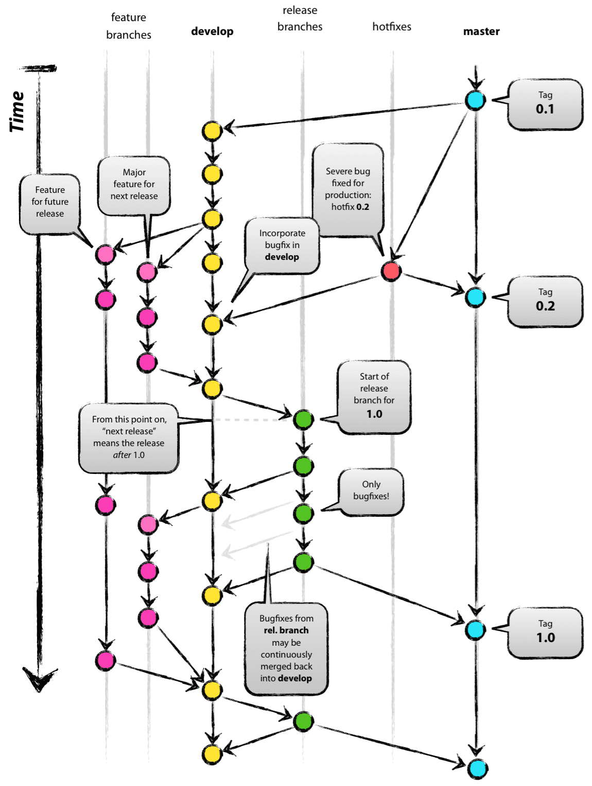

# GIT

## Зачем?

Git нужен для управления версиями исходного кода программ. Он позволяет отслеживать любые изменения в файлах, хранить их версии и оперативно возвращаться в любое сохранённое состояние.

Возможности git: 
- **Параллельная разработка.** Несколько программистов одновременно вносят изменения в одно приложение или сайт, но при этом не мешают друг другу и дополняют продукт.
- **Прозрачная история изменений.** Можно просматривать временную шкалу изменений, решений и хода выполнения любого проекта в одном месте.
- **Защита от ошибок.** В случае ошибки можно откатиться с минимальной потерей работоспособного кода.
- **Восстановление проекта.** Даже если с центральным хранилищем что-то случится, проект можно восстановить из копий участников команды.

## Консоль

Разумеется, системами контроля версий можно пользоваться при помощи любых грфическимих интерфейсов, таких как gitk, GitHub, GitKraken и т.д., однако следует хорошо разобраться именно с консольными командами.

### Репозиторий

Создание репозитория
```sh
git init
```

Клонирование репозитория
```sh
git clone <repository>
```

### Локальные изменения

Просмотр изменённых файлов 
```sh
git status
```

Изменения в отслеживаемых файлах
```sh
git diff
```

Добавление текущих изменений в список на коммит
```sh
# Все текущие изменения
git add -A
# Конкретные изменения в файле
git add -p <file>
```

Фиксация локальных изменений
```sh
git commit -m "New commit"
# Измений последний коммит (до публикации!)
git commit --amend
```

### История

История изменений
```sh
# Коммиты
git log
# Изменения в файле
git log -p <file>
```

Подробный лог изменений в файле
```sh
git blame <file>
```

### Ветки и теги

Список веток
```sh
git branch -av
```

Переключение в HEAD ветки
```sh
git checkout <branch-name>
# Получить версию файла из конкретного коммита
git checkout <commit> <file>
```

Создать новую ветку на основе текущей
```sh
git branch <branch-name>
```

Создать новую ветку и переключиться в неё
```sh
git checkout -b <branch-name>
```

Создать новую отслеживаемую ветку на основе удалённой ветки
```sh
git checkout --track <repository/branch>
```

Удалить локульную ветку
```sh
git branch -d <branch-name>
```

Присвоить текущему коммиту тег
```sh
git tag <tag-name>
```

### Обновление и публикация

Список прилинкованных репозиториев
```sh
git remote -v
```

Вывод информации о репозитории
```sh
git remote show <repository>
```

Добавить удалённый репозиторий
```sh
git remote add <name> <url>
```

Стянуть изменения
```sh
git pull <repository> <branch>
```

Опубликовать изменения
```sh
git push <repository> <branch>
```

Опубликовать теги
```sh
git push --tags
```

### Слияние и перемещение

Слияние ветки с текущей
```sh
git merge <branch>
```

Переместить HEAD на ветку
```sh
git rebase <branch>
# Отменить
git rebase --abort
# Продолжить перемещение после разрешения конфликтов
git rebase --continue
```

### Отмена всего подряд

Удалить все локальные изменения в рабочем каталоге
```sh
git reset --hard HEAD
```

В отдельном файле
```sh
git checkout HEAD <file>
```

Откаить коммит
```sh
git revert <commit>
```

Сбросить HEAD на предыдущий коммит и отменить изменения после него
```sh
git reset --hard <commit>
```

Сохранить все изменения как незакомиченные
```sh
git reset <commit>
```

## А как ветвить?

Разумеется, нет идеального способа организации ваших репозиториев. В некоторых проектах вообще достаточно одной ветки master, тогда как в других необходимо организовать сложную систему с доступами. Однако есть некоторые стратегии, которые зарекомендовали себя на рынке.

Следующие примеры взяты из [статьи на хабре](https://habr.com/ru/companies/itglobalcom/articles/535524/).

### GitHubFlow

Основные требования этой стратегии звучат так:
- в коде в мастер-ветке не допускаются ошибки, и он должен быть готов к развертыванию в любой момент;
- чтобы начать разрабатывать новую функцию, необходимо создать feature-ветку в master-ветке и дать ей очевидное для всех имя. Когда работа будет готова, ее нужно смерджить в master-ветку через pull request;
- после мерджа изменений их нужно сразу же развернуть на сервере.

Этот подход обычно используют для продуктов с одной версией, которая обновляется не очень часто. Например, веб-сайтов. Из плюсов — разработчикам при таком подходе проще понимать и организовывать свою работу. Главный минус — если ваш проект достаточно сложный и обновляется часто, лучше использовать другую стратегию.

### GitFlow

> Сразу стоит сказать, что эта стратегия дискуссионная. О ней есть много как положительных, так и отрицательных отзывов.

Есть два типа постоянных веток: master-ветка, чтобы понимать, как выглядит последняя актуальная версия, и development-ветка, где ведется разработка. От нее идут три вида временных веток.

- Feature, для добавления новых возможностей. После завершения работы нужно создать pull request в development-ветку.
- Release, для работы над новыми версиями. Важно добавить в название номер версии, это поможет не запутаться и отследить изменения.
- Hotfix, для быстрого исправления багов.



Этот подход считается одним из оптимальных для проектов, где постоянно разрабатывается несколько версий для разных платформ.

### Forking Workflow

Здесь подход такой: существует оригинальный репозиторий для мерджа всех изменений и его копия, в которой работает другой разработчик. Подход очень близок к идеологии open source, его цель — использовать все преимущества open-source-сообщества в рамках проекта. При этом большая часть рабочего процесса в части ветвления копирует GitFlow. Feature-ветки здесь будут мерджиться с локальными репозиториями разработчиков. Таким образом, разработка становится гибкой даже для очень больших команд с подрядчиками.

### А как ветвят в M18?

Есть ещё один подход к ветвлению ветвей. Назавём его branch = developer. Достаточно простая в реализации стратегия, когда в проекте не выделяется работа над какими-то фичами, а идёт поддержка продукта, исправление багов и небольшие изменения.

Разумеется, никто не запрещает создавать дополнительно ветви под фичи, если они достаточно масштабные и автономные.


## А где репозитории хранить?

Вариантов для большинства задач всего 2. Другие я бы рассматривал только в крайней необоходимости.

### GitHub

Тут много говорить не приходится. GitHub — самый популярный сервис для хранения ваших проектов, хотя и со своими хитростями.

Если ваш проект не имеет повышеную секретность или вы разрабатываете open-source продукты, то это отличный вариант.

> Забавно, но сам github имеет закрытый исходны код

### GitLab

Если у вас недоверие ко всему проприетарному, есть своя компания или вы просто хотите повы@бываться, то можно поднять gitlab на своём сервере. У него открытый исходны код, нет проблем с лицензией, поэтому пользуйтесь на здоровье.
